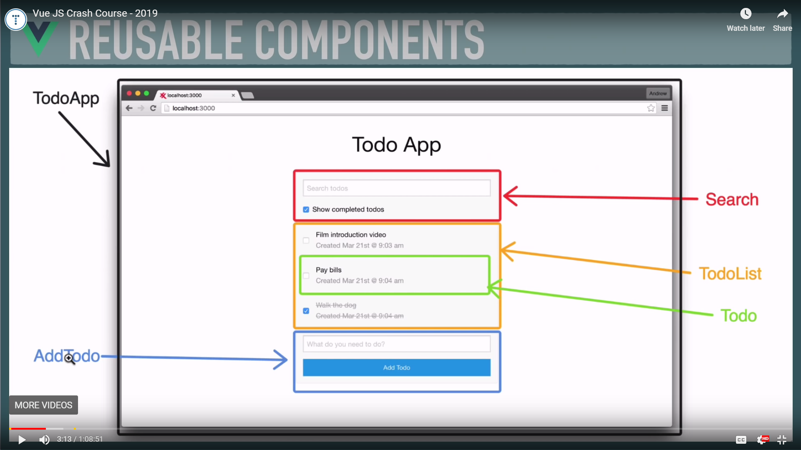
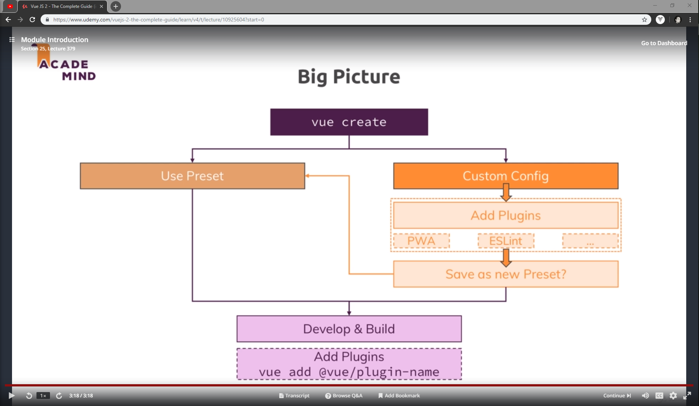
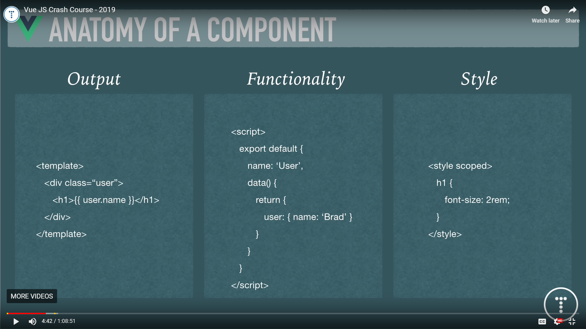
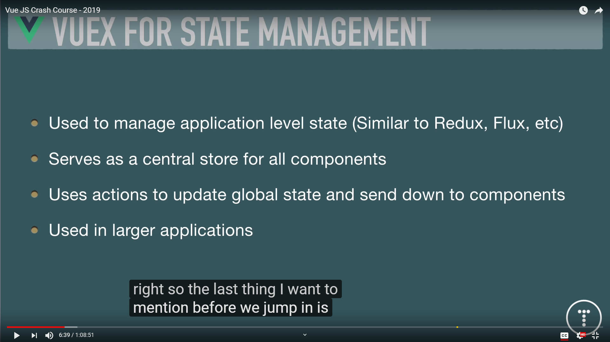

[](https://app.netlify.com/sites/hopeful-meninsky-bf657b/deploys)
# Vue JS Crash Course - 2019

Brad Traversy

[](https://youtu.be/Wy9q22isx3U)
[video link --^](https://youtu.be/Wy9q22isx3U)



## What you should know

### JavaScript Fundamentals

```md
- [X] Objects

- [X] Arrays

- [X] Conditionals
```

#### It may help to learn these first

```md
[/] ES6 Module Syntax

[/] High Order Array Methods
- [ ] forEach
- [ ] map
- [ ] filter

[/] Arrow Functions

[/] Fetch API & Promises
```

---

## Reusable Components


## Anatomy of a Component



## VUE-CLI 3


### CLI Commands

#### Install vue globally

```bash
npm -g @vue/cli
```

#### Check version installed

```bash
vue --version
```

#### Create Project

```bash
vue create
 - select defaults (babel, etc)

cd test
npm run serve

```

#### Vue GUI (dashboard, analytics, etc.)

Start GUI

```bash
vue ui
```

Stop Server

```bash
^C  // ctrl+c
```

## Vuex for State Management (not covered)




## The Big Picture


## Project setup
```
npm install
```

### Compiles and hot-reloads for development
```
npm run serve
```

### Compiles and minifies for production
```
npm run build
```

### Run your tests
```
npm run test
```

### Lints and fixes files
```
npm run lint
```

### Customize configuration
See [Configuration Reference](https://cli.vuejs.org/config/).
