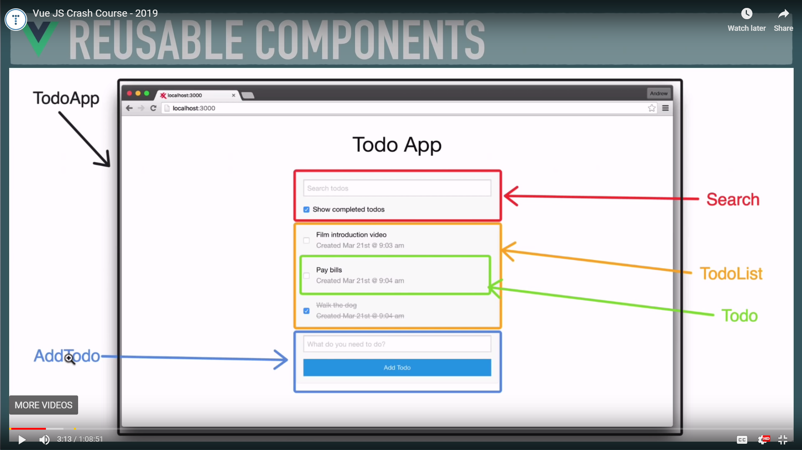
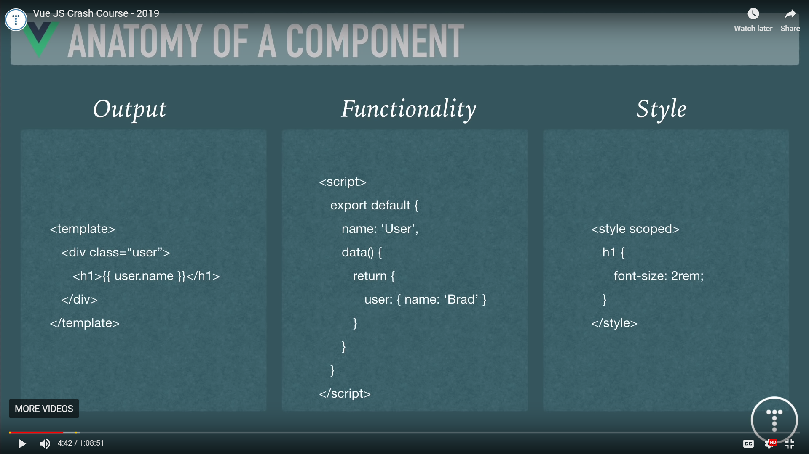
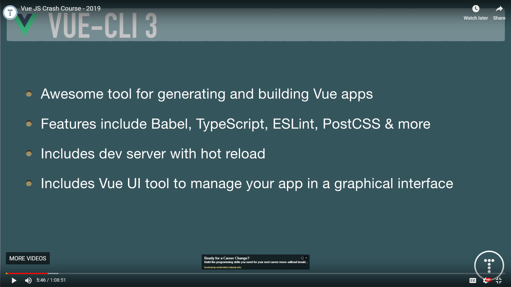

# Vue JS Crash Course - 2019

Brad Traversy

[](https://youtu.be/Wy9q22isx3U)


## What you should know

### JavaScript Fundamentals

```md
- [X] Objects

- [X] Arrays

- [X] Conditionals
```

#### It may help to learn these first

```md
[/] ES6 Module Syntax

[/] High Order Array Methods
- [ ] forEach
- [ ] map
- [ ] filter

[/] Arrow Functions

[-] Fetch API & Promises
```

---

## Reusable Components


## Anatomy of a Component



## VUE-CLI 3



### CLI Commands

#### Install vue globally

```bash
npm -g @vue/cli
```

#### Check version installed

```bash
vue --version
```

#### Create Project

```bash
vue create
 - select defaults (babel, etc)

cd test
npm run serve

```

#### Vue GUI (dashboard, analytics, etc.)

Start GUI

```bash
vue ui
```

Stop Server

```bash
^C  // ctrl+c
```

[left off](https://youtu.be/Wy9q22isx3U?t=607)

## Vuex for State Management (not covered)


